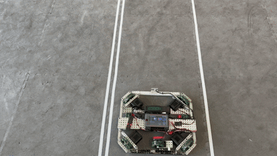
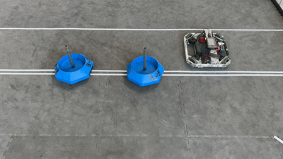
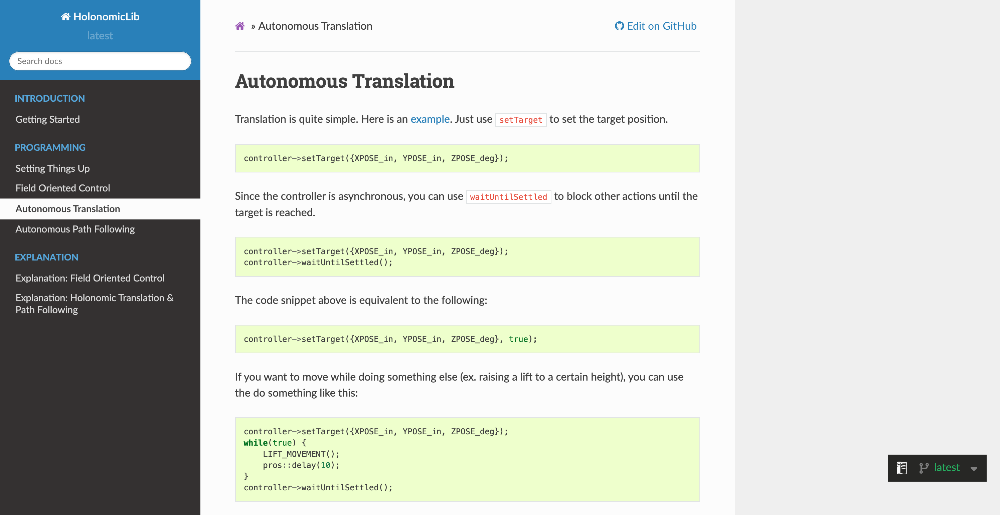
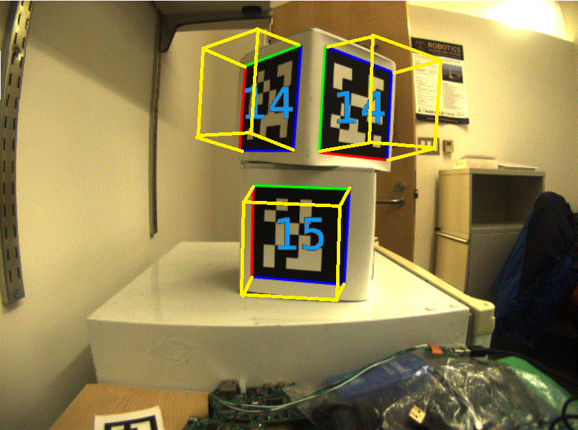
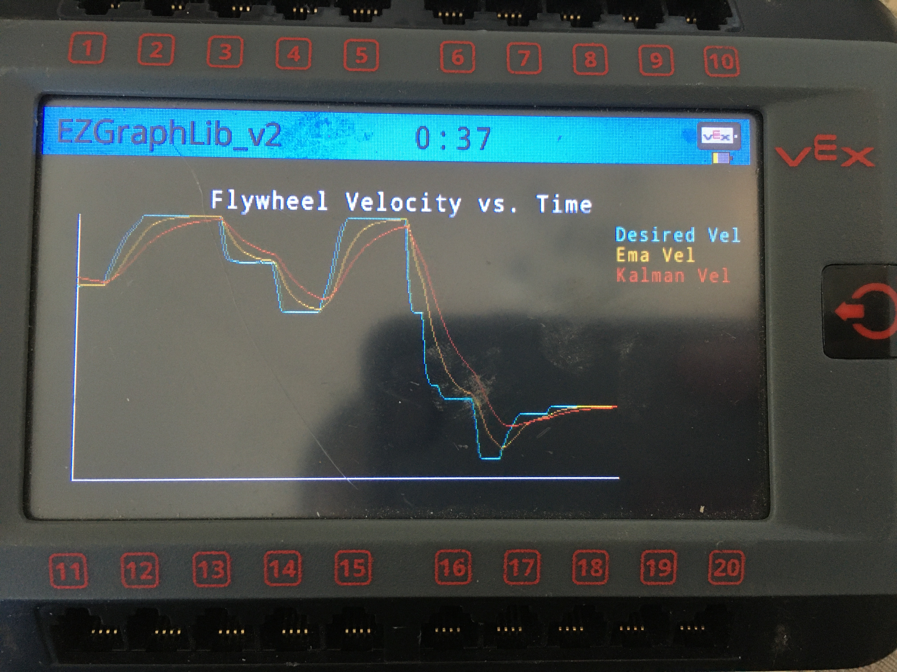
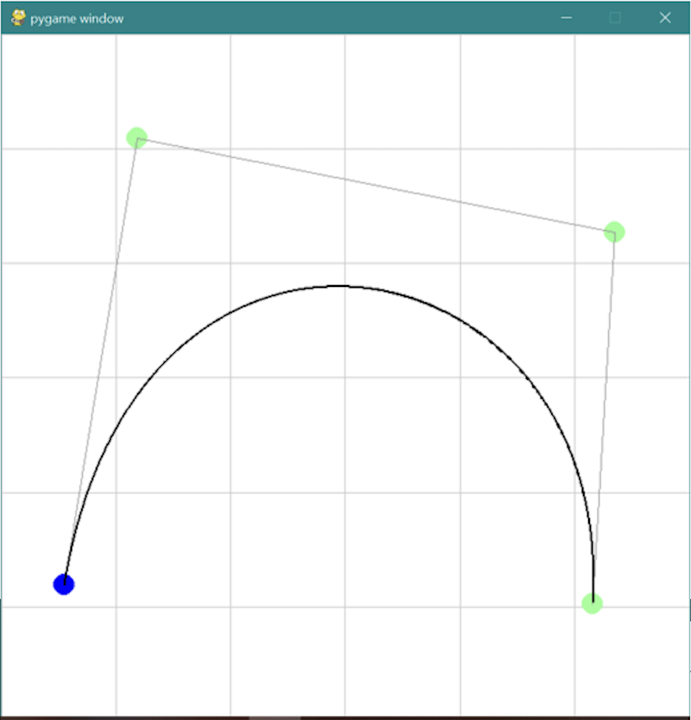
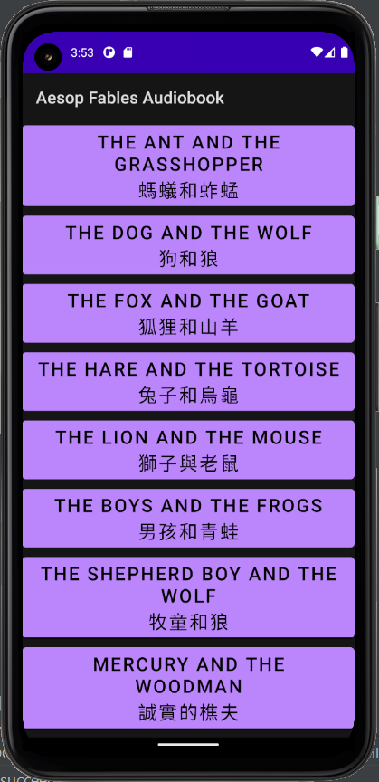

### [HolonomicLib: A C++ motion planning library for holonomic drives.](https://github.com/jazonshou/HolonomicLib)

Example 1: Spline Translation (with changing heading)

Example 2: Spline Translation (no change in heading)

<small>The full videos can be found <a href="https://youtu.be/jp1LXxvW4yo">here</a> and 
<a href="https://youtu.be/jArjx3Lgaqg">here</a>.</small>

The library includes detailed [API documentation](https://jazonshou.github.io/HolonomicLib/index.html) 
along with [step-by-step guides](https://holonomiclibdocs.readthedocs.io/en/latest/index.html) for 
getting started. 

### [On-the-fly Path Generation](https://github.com/TASRobotics/Spline-Simulation)

Generates motion profiles based on spline paths at any location on the field. Generated paths 
avoid "no-go" zones where the robot cannot be (i.e. the white platform). 

[.gif)](https://www.youtube.com/watch?v=dLqRS37pCEk&ab_channel=JasonCollins)

<small>The full video can be found <a href="https://youtu.be/dLqRS37pCEk">here</a>.</small>

### [Sensor Fusion Localization](https://github.com/TASRobotics/RaidZero-FRC-2024)

Combines dead-reckoning with AprilTag-based visual odometry using a Kalman filter. 

### [Graphy: A C++ graphing library for robotics.](https://github.com/jazonshou/Graphy)

Features a simple graphing interface for data visualization. 

### [Bezier Curve Visualizer/Generator](https://github.com/jazonshou/4253B-Bezier-Visualizer)

Generates constants for bezier curves. Built with pygame. 

### [Bilingual Audiobook App for Aesop Fables](https://github.com/jazonshou/Audiobook-Eagle-Project)

Created with Android Studio. 

